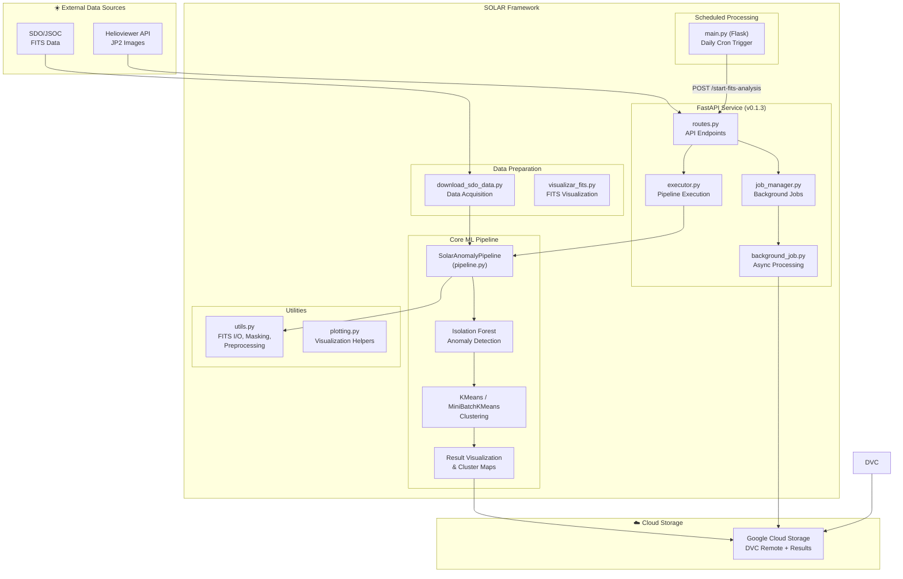
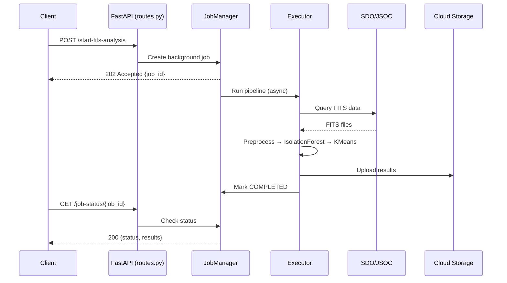

<p align="center">
  <h1 align="center">SOLAR</h1>
  <p align="center"><strong>Solar Observer Learning Anomaly Recognition</strong></p>
  <p align="center">Unsupervised anomaly detection in multi-channel SDO/AIA solar imagery</p>
</p>

<p align="center">
  
  
  
  
  
  
  
  
</p>

---

## Table of Contents

- [Overview](#overview)
- [Key Features](#-key-features)
- [Architecture](#-architecture)
- [Project Structure](#-project-structure)
- [Getting Started](#-getting-started)
- [Usage](#-usage)
- [API Reference](#-api-reference)
- [Data & Reproducibility](#-data--reproducibility)
- [Technology Stack](#-technology-stack)
- [Troubleshooting](#-troubleshooting)
- [License](#-license)
- [Authors & Contributors](#-authors--contributors)
- [Changelog](#changelog)

---

## Overview

**SOLAR** (Solar Observer Learning Anomaly Recognition) is a research-driven framework for detecting and characterizing atypical events in solar imagery captured by the **Atmospheric Imaging Assembly (AIA)** aboard NASA's **Solar Dynamics Observatory (SDO)**.

The project applies unsupervised machine learning techniques — primarily **Isolation Forest** for anomaly detection and **KMeans / MiniBatchKMeans** for anomaly characterization — to multi-channel extreme ultraviolet (EUV) observations. By analyzing multiple wavelength channels simultaneously (94 Å, 131 Å, 171 Å, 193 Å, 211 Å, 304 Å, 335 Å, and more), SOLAR identifies spatial regions exhibiting unusual spectral signatures that may correspond to scientifically interesting phenomena such as flares, coronal mass ejections, or other transient events.

The system is designed to support solar physics research by:

- **Prioritizing regions of interest** without requiring manually labeled training data.
- **Providing interpretable clustering** of detected anomalies for downstream expert analysis.
- **Operating at scale** via a REST API and automated scheduled processing pipeline deployed on Google Cloud Platform.

---

## 🔑 Key Features

- **Multi-channel anomaly detection** — Processes 7+ SDO/AIA EUV channels simultaneously using Isolation Forest to flag spatially anomalous regions on the solar disk.
- **Anomaly clustering & characterization** — Groups detected anomalies into distinct clusters (KMeans, MiniBatchKMeans) to differentiate between types of atypical events.
- **End-to-end scientific pipeline** — From FITS/JP2 data ingestion and solar-disk masking through preprocessing, anomaly scoring, clustering, and result visualization.
- **REST API service** — FastAPI-based service (v0.1.3) providing endpoints for SDO data retrieval via JSOC/Helioviewer, analysis execution, and background job management.
- **Scheduled batch processing** — Automated daily processing of the latest SDO observations via a Flask-based scheduler deployed on Google Cloud Run.
- **Data versioning** — Full reproducibility through DVC with Google Cloud Storage as a remote backend.
- **Cloud-native deployment** — Dockerized services with Cloud Build CI/CD pipelines.

---

## 🏗 Architecture

### High-Level System Overview



### ML Pipeline Flow

```mermaid
flowchart LR
    A["FITS Files<br/>(per channel)"] --> B["Load & Parse<br/>sunpy.map.Map"]
    B --> C["Solar Disk Masking<br/>Circular Mask from Header"]
    C --> D["Preprocessing<br/>Resize · Normalize<br/>RobustScaler"]
    D --> E["Multi-Channel<br/>Feature Concatenation"]
    E --> F["Isolation Forest<br/>Anomaly Scoring"]
    F --> G["Threshold Filtering<br/>Anomaly Mask"]
    G --> H["KMeans / MiniBatch<br/>Clustering"]
    H --> I["2D Cluster Map<br/>Visualization"]

    style A fill:#e1f5fe
    style F fill:#fff3e0
    style H fill:#f3e5f5
    style I fill:#e8f5e9
```



### API Request Flow



---

## 📁 Project Structure

```text
SOLAR/
├── API/                            # FastAPI REST service
│   ├── Dockerfile                  #   Container build config
│   ├── requirements.txt            #   API-specific pinned dependencies
│   └── app/
│       ├── main.py                 #   FastAPI application entry point (v0.1.3)
│       ├── api/
│       │   ├── routes.py           #   Endpoint definitions (JSOC, Helioviewer, analysis)
│       │   └── pipeline/
│       │       ├── executor.py     #   Pipeline execution orchestration
│       │       ├── job_manager.py  #   Background job state tracking
│       │       ├── background_job.py   Async job runner
│       │       ├── data_loader.py  #   Data ingestion helpers
│       │       ├── fits_loader.py  #   FITS file loading
│       │       ├── preprocess.py   #   Image preprocessing
│       │       ├── model.py        #   ML model inference
│       │       └── visualization.py    Result rendering
│       └── config/
│           └── settings.py         #   Environment-based configuration
├── scheduled_processing/           # Automated batch processing
│   ├── Dockerfile                  #   Container build config
│   ├── main.py                     #   Flask scheduler (daily cron)
│   └── requirements.txt            #   Scheduler dependencies
├── src/                            # Core library
│   ├── data_prep/                  #   Data acquisition & preparation
│   │   ├── download_sdo_data.py    #   SDO/JSOC download scripts
│   │   └── visualizar_fits.py      #   FITS visualization utilities
│   ├── solar/                      #   ML pipeline
│   │   ├── pipeline.py             #   SolarAnomalyPipeline class
│   │   ├── run_kmeans_pipeline.py  #   CLI entrypoint for pipeline execution
│   │   └── kmeans/                 #   KMeans-specific modules
│   └── utils/                      #   Shared utilities
│       ├── utils.py                #   FITS I/O, masking, preprocessing, scaling
│       └── plotting.py             #   Visualization helpers
├── notebooks/                      # Exploratory analysis & experiments
│   ├── eda_sdo_aia/                #   SDO/AIA data exploration
│   ├── eda_clustering/             #   Clustering analysis (DBSCAN, GMM, KMeans)
│   ├── model_test/                 #   Model experiments (IsolationForest, LOF, NormFlow)
│   └── first_clustering_resize/    #   Initial clustering experiments
├── test/                           # Test suite
│   └── unit_tests/                 #   Unit tests for solar & utils modules
├── datos/                          # Sample data (FITS & JP2)
├── config/                         # DVC & project configuration
├── .github/workflows/main.yml      # GitHub Actions CI pipeline
├── pyproject.toml                  # Project config, dependencies, and tool settings
├── Makefile                        # Development workflow commands
├── cloudbuild.yaml                 # Google Cloud Build pipeline
├── sdo_data.dvc                    # DVC tracking file for SDO data
├── CHANGELOG.md                    # Release history
└── LICENSE                         # Dual license (Academic Free / Commercial)
```

---

## 🚀 Getting Started

### Prerequisites

- **Python 3.12+**
- **[uv](https://docs.astral.sh/uv/)** (modern Python package manager)
- **Git** and optionally **DVC** (for data versioning)
- Google Cloud credentials (only required for GCS-backed DVC remote or API deployment)

### Install uv

```bash
# macOS / Linux
curl -LsSf https://astral.sh/uv/install.sh | sh

# Or with Homebrew
brew install uv
```

### Installation

1. **Clone the repository:**

   ```bash
   git clone https://github.com/AlyonaCIA/SOLAR.git
   cd SOLAR
   ```

2. **Install core dependencies** (uv creates the virtualenv automatically):

   ```bash
   uv sync
   ```

3. **Install with development tools** (Ruff, mypy, pytest):

   ```bash
   make install-dev
   # or: uv sync --extra dev
   ```

4. **Install with API dependencies:**

   ```bash
   uv sync --extra api
   ```

5. **Install everything:**

   ```bash
   make install-all
   # or: uv sync --all-extras
   ```

6. **(Optional) Pull versioned data with DVC:**

   ```bash
   uv run dvc pull
   ```

---

## 💻 Usage

### Running the Pipeline Locally

The `SolarAnomalyPipeline` can be executed via the CLI script:

```bash
uv run python src/solar/run_kmeans_pipeline.py \
  --data_dir ./datos/muestras_FITS/20250522_180000 \
  --channels 94 131 171 193 211 304 335 \
  --output_dir ./output_results \
  --anomaly_thresholds 0.10 \
  --n_clusters 7 \
  --image_size 512 \
  --cluster_method KMeans

# Or using Make:
make run-pipeline ARGS="--data_dir ./datos/muestras_FITS/20250522_180000 --channels 94 131 171"
```

#### CLI Arguments

| Argument | Default | Description |
|---|---|---|
| `--data_dir` | `Data/sdo_data` | Path to SDO/AIA channel subdirectories |
| `--channels` | `94 131 171 193 211 233 304 335 700` | AIA wavelength channels to process |
| `--anomaly_thresholds` | `0.1` | Isolation Forest contamination threshold |
| `--output_dir` | `./output_figures_kmeans` | Directory for output figures & results |
| `--image_size` | `512` | Resize dimension (square); `-1` for original |
| `--n_clusters` | `7` | Number of clusters for anomaly grouping |
| `--cluster_method` | `KMeans` | Clustering algorithm (`KMeans` or `MiniBatchKMeans`) |

### Running the Pipeline Programmatically

```python
from src.solar.pipeline import SolarAnomalyPipeline

pipeline = SolarAnomalyPipeline(
    data_dir="./datos/muestras_FITS/20250522_180000",
    output_dir="./results",
    channels=["94", "131", "171", "193", "211", "304", "335"],
    image_size=512,
    contamination=0.05,
    n_clusters=7,
    cluster_method="KMeans",
)
results = pipeline.run()
```

---

## 🌐 API Reference

### Starting the API Server

```bash
make run-api
# or: cd API && uv run uvicorn app.main:app --host 0.0.0.0 --port 8080 --reload
```

Interactive documentation is available at `http://localhost:8080/docs` (Swagger UI).

### Key Endpoints

| Method | Endpoint | Description |
|---|---|---|
| `GET` | `/` | Health check and API status |
| `GET` | `/docs` | Interactive Swagger documentation |
| `POST` | `/start-fits-analysis` | Start a background FITS analysis job |
| `GET` | `/job-status/{job_id}` | Check progress of a background job |
| `POST` | `/query-sdo-data` | Query SDO/JSOC for available data |
| `POST` | `/fetch-helioviewer` | Download JP2 images from Helioviewer |

### Docker Deployment

```bash
cd API
docker build -t solar-api .
docker run -p 8080:8080 solar-api
```

---

## 📊 Data & Reproducibility

- **Data versioning** — All science data is tracked with [DVC](https://dvc.org/) using Google Cloud Storage as the remote backend (`ml-project-dvc-bucket`).
- **Sample data** — Small samples are included in `datos/` (FITS and JP2 formats) and `API/test/testing_input/` for development and testing.
- **Configuration** — Reference configs stored in `config/`. DVC commands documented in `config/dvc_command.txt`.
- **Reproducibility** — Use `dvc repro` or the CLI script with fixed `--random_state` to reproduce results exactly.

---

## 🛠 Technology Stack

| Category | Technologies |
|---|---|
| **Core Language** | Python 3.12+ |
| **Package Manager** | [uv](https://docs.astral.sh/uv/) |
| **ML / Anomaly Detection** | scikit-learn (IsolationForest, KMeans, MiniBatchKMeans) |
| **Solar Data** | SunPy 6.0+, Astropy 6.0+, Glymur (JP2), JSOC/Fido |
| **Image Processing** | NumPy, SciPy, scikit-image, Pillow |
| **Visualization** | Matplotlib |
| **API Framework** | FastAPI 0.115, Uvicorn, Pydantic |
| **Scheduled Processing** | Flask, APScheduler |
| **Linting & Formatting** | [Ruff](https://docs.astral.sh/ruff/) (replaces flake8, pylint, isort, autopep8) |
| **Type Checking** | mypy |
| **Data Versioning** | DVC with Google Cloud Storage remote |
| **Cloud / Deployment** | Docker, Google Cloud Build, Google Cloud Run |
| **CI/CD** | GitHub Actions |
| **Testing** | pytest, pytest-cov |

---

## � Troubleshooting

**Issue:** Slow API responses
- **Solution:**
  - Check if the pipeline is properly cached
  - Verify FITS data is loaded correctly
  - Monitor system resources (CPU, memory)
  - Check logs for errors: `make logs`

**Issue:** Job not found (404)
- **Solution:**
  - Jobs may expire after processing completes
  - Verify job ID is correct UUID format
  - Check if the job was created successfully
  - Use status endpoint: `GET /job-status/{job_id}`

**Issue:** Docker build fails
- **Solution:**
  - Clear Docker cache: `docker system prune -a`
  - Verify Dockerfile syntax
  - Check network connectivity for package downloads
  - Use `docker build --no-cache` for clean build

**Issue:** mypy type errors
- **Solution:**
  ```bash
  # Check specific file
  uv run mypy src/specific/file.py
  # Update type stubs
  uv pip install types-all
  # See mypy config
  cat pyproject.toml | grep -A 20 "\[tool.mypy\]"
  ```

**Issue:** Ruff linting errors
- **Solution:**
  ```bash
  # Auto-fix all fixable issues
  make format
  # Check without fixing
  make lint
  # Check specific file
  uv run ruff check src/solar/pipeline.py
  ```

### Debugging Tips

1. **Enable Debug Logging**: Set `LOG_LEVEL=DEBUG` in your environment
2. **Check Logs**: Monitor application logs for errors
3. **Use Interactive Docs**: Test API at `http://localhost:8080/docs`
4. **Run Tests in Verbose**: `uv run pytest -vv --tb=long`
5. **Check Dependencies**: `uv pip list` to verify installed packages

### Performance Optimization

- **Increase Workers**: For production, use multiple Uvicorn workers
  ```bash
  uvicorn app.main:app --workers 4 --host 0.0.0.0 --port 8080
  ```
- **Image Size**: Use `--image_size 512` (default) for faster processing; increase for higher resolution
- **MiniBatchKMeans**: Use `--cluster_method MiniBatchKMeans` for large datasets
- **Contamination Threshold**: Adjust `--anomaly_thresholds` to control anomaly sensitivity

### Available Make Commands

```bash
make help          # Show all available commands
make install       # Install core dependencies
make install-dev   # Install with dev tools
make install-all   # Install all dependency groups
make lint          # Run Ruff linter
make format        # Auto-fix formatting and lint issues
make type-check    # Run mypy
make check         # Run all code quality checks
make test          # Run tests
make test-cov      # Run tests with coverage
make run-api       # Start FastAPI server
make run-pipeline  # Run ML pipeline
make clean         # Remove caches and build artifacts
```

---

## �📄 License

This project is distributed under a **dual license** model:

| Use Case | License | Cost |
|---|---|---|
| Academic, research, educational, non-profit | **Academic & Non-Commercial License** | Free |
| Commercial, enterprise, revenue-generating | **Commercial License** | Paid (contact author) |

See [LICENSE](LICENSE) for full terms.

**Questions?** Contact: alenacivanovaa@gmail.com

---

## Author

<div align="center">

### Alyona Carolina Ivanova Araujo

**MSc in Artificial Intelligence & Astrophysics | Principal Investigator**

**Email:** alenacivanovaa@gmail.com
**GitHub:** [@AlyonaCIA](https://github.com/AlyonaCIA)
**Version:** 0.2.0

---

### Supervisor

**Carlos José Díaz Baso**
Postdoktor — Rosseland Centre for Solar Physics, University of Oslo
[carlos.diaz@astro.uio.no](mailto:carlos.diaz@astro.uio.no)

### Co-Supervisor

**Juan Camilo Guevara Gomez**
[juancamilo.guevaragomez@gmail.com](mailto:juancamilo.guevaragomez@gmail.com)

---

### Project Stats


</div>

---

## Acknowledgments

This project was built with:
- Modern Python development practices and tooling
- Unsupervised machine learning for scientific discovery
- Comprehensive CI/CD pipeline with GitHub Actions
- Enterprise-grade code quality standards (Ruff, mypy)
- Community-driven open source values

Special thanks to:
- **SunPy Community** for the solar data analysis framework
- **scikit-learn Team** for powerful ML tools
- **FastAPI Community** for the excellent web framework
- **uv Team** for revolutionizing Python package management
- Open source contributors and maintainers

### Contributing Engineers (AI / ML)

- Andres Forero
- Santiago Calderón López
- Camilo Matson Hernandez
- Andres Vega

---

<div align="center">

**If you find this project useful, please consider giving it a ⭐ star!**

Made with precision and care by Alyona Carolina Ivanova Araujo

</div>

---

## Changelog

See [CHANGELOG.md](CHANGELOG.md) for the full release history.
