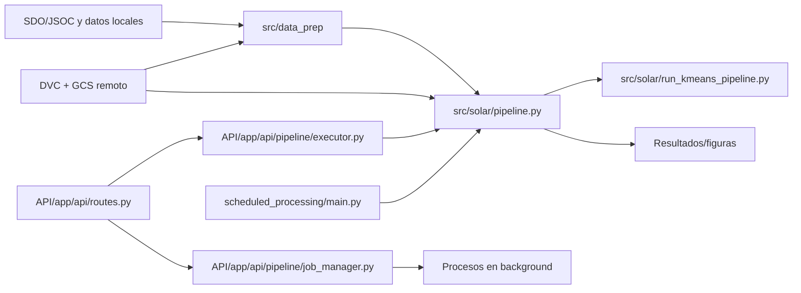

# SOLAR

**Solar Observer Learning Anomaly Recognition**


Proyecto para detección no supervisada de anomalías en imágenes multicanal de **SDO/AIA**, con pipeline científico en `src/`, API en `API/` y procesamiento programado en `scheduled_processing/`.

---

## 🎯 Objetivo

SOLAR busca identificar patrones atípicos en datos solares sin etiquetas previas, apoyando exploración científica y priorización de eventos para análisis experto.

## 🔍 Qué hace el repositorio

- Descarga y prepara datos SDO/AIA (FITS/JP2) para análisis reproducible.
- Ejecuta detección de anomalías con `IsolationForest`.
- Caracteriza anomalías con clustering (`KMeans`, `MiniBatchKMeans`, `GMM`).
- Expone endpoints en FastAPI para flujos operativos y ejecución en background.
- Soporta versionado de datos con DVC.

## 🧱 Arquitectura



## Estructura principal

```text
API/                    # Servicio FastAPI
scheduled_processing/   # Procesamiento batch/programado
src/data_prep/          # Descarga y preparación de datos
src/solar/              # Pipeline ML principal
src/utils/              # Utilidades de procesamiento y visualización
notebooks/              # EDA y experimentación
datos/                  # Muestras de datos
test/                   # Pruebas
```

## Quick Start

1. Clona el repositorio:

   ```bash
   git clone https://github.com/AlyonaCIA/SOLAR.git
   cd SOLAR
   ```

2. Crea y activa entorno virtual:

   ```bash
   python3 -m venv .venv
   source .venv/bin/activate
   ```

3. Instala dependencias:

   ```bash
   pip install -r requirements.txt
   ```

4. (Opcional) instala dependencias del API:

   ```bash
   pip install -r API/requirements.txt
   ```

5. Si trabajas con DVC + GCS, configura credenciales y ejecuta:

   ```bash
   dvc pull
   ```

## Ejecución

### Pipeline local

```bash
python src/solar/run_kmeans_pipeline.py \
  --data_dir ./datos/muestras_FITS/20250522_180000 \
  --channels 94 131 171 193 211 304 335 \
  --output_dir ./output_results \
  --anomaly_thresholds 0.10 \
  --n_clusters 7 \
  --image_size 512
```

### API

```bash
cd API
uvicorn app.main:app --host 0.0.0.0 --port 8080 --reload
```

Documentación interactiva: `http://localhost:8080/docs`

## Datos y reproducibilidad

- Datos versionados con DVC.
- Configuración de referencia en `config/`.
- Muestras incluidas en `datos/` y `API/test/testing_input/`.

## Licencia

Este proyecto usa un esquema de **licencia dual**:

- Uso **académico/no comercial**: gratuito.
- Uso **comercial/empresarial**: requiere licencia comercial.

Consulta los términos completos en `LICENSE`.

## Changelog

Historial de cambios en `CHANGELOG.md`.

## Autor

**Alyona Carolina Ivanova Araujo**

Para temas de colaboración académica o licencia comercial, usar los canales de contacto del proyecto.
